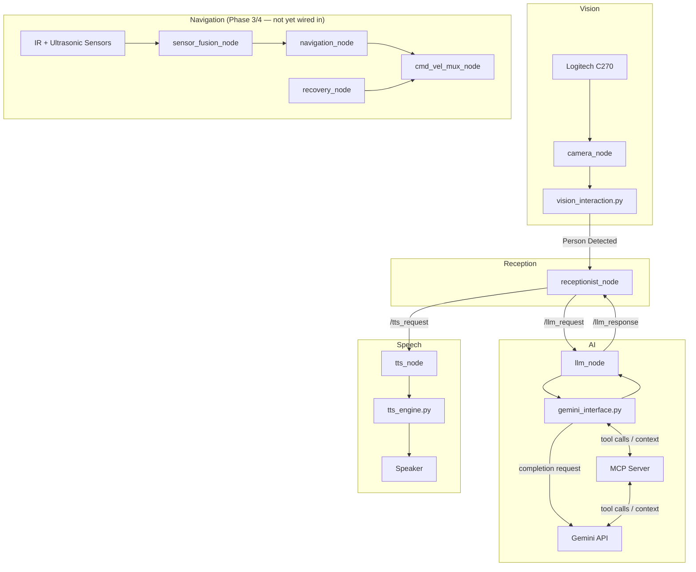

# Autonomous Receptionist Robot

> **Status:** 🚧 Active Development — currently in Phase 1 (AI Greeting Pipeline). Navigation and sensor-fusion modules are scaffolded in the repo for later phases but are **not yet wired into the live pipeline**.

An AI-powered autonomous receptionist robot built with **ROS 2**, **Python**, **Gemini**, and the **Model Context Protocol (MCP)**. The system is designed around a modular ROS architecture where perception, AI, speech, and navigation are independent components that can evolve without affecting one another.

---

## Overview

The robot is designed to:

- Detect approaching visitors using a Logitech C270 USB camera.
- Generate intelligent greetings using Gemini, with MCP exposing robot-side context (e.g. visitor info, room directory) as tools Gemini can call.
- Speak naturally using a dedicated Text-to-Speech pipeline.
- Escort visitors to destinations using ROS 2 Navigation (Phase 3/4).
- Fuse multiple sensors for safe autonomous navigation (Phase 3/4).
- Provide a scalable architecture for future voice conversations and cloud services.

---

## Hardware

| Component | Purpose |
|---|---|
| Raspberry Pi 4 | Main onboard computer |
| Logitech C270 USB Camera | Face detection, QR scanning, visual perception |
| 8× IR Sensors | Close-range obstacle detection |
| 8× Ultrasonic Sensors | Medium-range obstacle detection |
| Omnidirectional Drive Base | Robot mobility |
| Motor Controller | Low-level motor control (developed by embedded team) |
| Speaker | Voice output |
| Microphone | Speech-to-Text / voice conversations — not yet installed; required before Phase 2 STT can run on-robot |

---

## Software Stack

| Layer | Technology | Status |
|---|---|---|
| Middleware | ROS 2 | In use |
| Language | Python | In use |
| Vision | OpenCV | In use |
| AI | Gemini | In use |
| AI Communication | MCP | In use |
| Navigation | Nav2 | Planned |
| SLAM | slam_toolbox | Planned |
| Speech | TTS Engine (Piper planned) | In progress |

---

## System Architecture



**Note on MCP:** MCP is not a transport layer for the Gemini API call itself — `gemini_interface.py` talks to the Gemini API directly. The MCP server exposes robot-side context and tools (visitor lookup, room directory, etc.) that Gemini can call during generation. Verify this matches your actual `gemini_interface.py` implementation and adjust the diagram if the real flow differs.

**Note on Navigation:** the navigation/sensor-fusion subgraph exists in the codebase (`navigation_node.py`, `sensor_fusion_node.py`, `recovery_node.py`, `cmd_vel_mux_node.py`) but nothing in the current greeting pipeline triggers it. It's drawn as a separate group on purpose — connect it to the rest of the graph once Phase 3 (Autonomous Navigation) actually wires it up.

---

## AI Greeting Pipeline

```text
Person Appears
      ↓
Camera Node
      ↓
Face Detection
      ↓
Receptionist Node
      ↓
LLM Node
      ↓
Gemini Interface  ──(tool calls via MCP)──►  Gemini API
      ↓
Receptionist Node
      ↓
TTS Node
      ↓
TTS Engine
      ↓
Speaker
```

---

## Project Structure

```text
Welcoming-Robot/
├── config/
├── core/
│   ├── astar.py                # A* path planning (Phase 3)
│   ├── fusion.py                # Sensor fusion algorithms (Phase 3)
│   ├── omni_controller.py       # Omnidirectional drive control (Phase 3)
│   ├── vision_interaction.py    # Face detection / visitor triggers (Phase 1)
│   ├── vision_navigation.py     # Vision-assisted navigation (Phase 3)
│   ├── gemini_interface.py      # Prompt building + MCP/Gemini calls (Phase 1)
│   └── tts_engine.py            # Speech synthesis implementation (Phase 1)
├── launch/
├── nodes/
│   ├── camera_node.py
│   ├── cmd_vel_mux_node.py
│   ├── llm_node.py
│   ├── navigation_node.py
│   ├── receptionist_node.py
│   ├── recovery_node.py
│   ├── sensor_fusion_node.py
│   └── tts_node.py
├── utils/
└── README.md
```

> Files marked "(Phase 3)" above are scaffolded but not yet part of the active pipeline — see the roadmap below. Verify these phase tags against actual implementation status before publishing.

---

## Component Responsibilities

| Component | Responsibility |
|---|---|
| `camera_node` | Camera capture and visitor detection |
| `vision_interaction.py` | Face detection logic, triggers visitor events |
| `receptionist_node` | Workflow orchestration |
| `llm_node` | ROS wrapper for Gemini |
| `gemini_interface.py` | Prompt engineering and MCP/Gemini communication |
| `tts_node` | ROS wrapper for speech |
| `tts_engine.py` | Speech synthesis implementation |
| `navigation_node` | Navigation and path planning |
| `astar.py` | A* path planning algorithm used by `navigation_node` |
| `omni_controller.py` | Low-level omnidirectional drive control |
| `vision_navigation.py` | Vision-assisted navigation support |
| `sensor_fusion_node` | Multi-sensor fusion (IR + ultrasonic) |
| `fusion.py` | Sensor fusion algorithms used by `sensor_fusion_node` |
| `recovery_node` | Recovery behaviors |
| `cmd_vel_mux_node` | Arbitrates velocity commands between navigation and recovery |

> Descriptions for the `core/` files were inferred from filenames only — confirm they're accurate before publishing.

---

## Development Roadmap

**Phase 1 — AI Greeting (current)**
- Face Detection
- Gemini + MCP integration
- Text-to-Speech

**Phase 2 — Conversation**
- Speech-to-Text (requires microphone hardware)
- Multi-turn Conversations
- Visitor Intent Recognition

**Phase 3 — Mobility**
- Raspberry Pi Deployment
- Hardware Integration (IR/ultrasonic sensors, motor controller)
- SLAM
- Autonomous Navigation (wire up `navigation_node`, `sensor_fusion_node`, `recovery_node`, `cmd_vel_mux_node` into the main pipeline)

**Phase 4 — Full Service**
- Escort Mode
- Voice Conversations
- Appointment Management
- Cloud Integration

---

## Known Gaps

- Navigation/sensor-fusion nodes are scaffolded in the repo but not connected to the greeting pipeline yet.
- No dedicated ROS node is currently listed for the IR/ultrasonic sensor drivers — clarify whether `sensor_fusion_node` subscribes directly to embedded-team topics or needs its own driver node.
- Microphone hardware isn't in the current build; required before Phase 2 STT can run on-device.
- Confirm the MCP role described here (tool/context exposure vs. transport) against the actual `gemini_interface.py` code.

---

## Notes

Performance metrics and CPU utilization will be documented after real-world testing on Raspberry Pi 4. No estimated performance values are included in this repository.

---

## License

Educational and research purposes.
