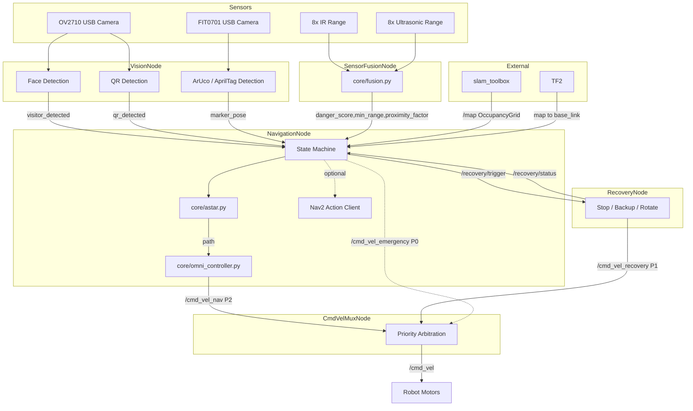

# 🤖 Autonomous Navigation Robot

## 🚧 Project Status

This project is currently in the **development phase**.  
The focus is on building a modular and scalable autonomous navigation system using ROS 2 and Python.

> ⚠️ Some components described below (e.g., advanced control and learning methods) are planned and not fully implemented yet.

---

## 🧠 Overview

This project aims to develop an **indoor autonomous robot** capable of:

- Mapping unknown environments (SLAM)  
- Localizing itself within a map  
- Planning optimal paths  
- Avoiding obstacles in real time  
- Controlling an omnidirectional drive system  

The system is designed with a **modular architecture** to allow easy integration of hardware and future expansion.

---

## 🏗️ System Architecture



```

```
    

---

## ⚙️ Technology Stack

- Middleware: ROS 2  
- Programming Language: Python  
- Motor Controller: NanoClaw  
- SLAM: SLAM Toolbox (planned)  
- Simulation (planned): Gazebo, RViz  

---

## 🧩 Core Components

### 1. Sensor Fusion (In Progress)
- Combines IR, ultrasonic, and camera data  
- Produces unified obstacle information  

---

### 2. Localization & Mapping (Planned)
- SLAM-based mapping  
- Robot pose estimation  

---

### 3. Global Path Planning (In Progress)
- A* algorithm on occupancy grid  
- Generates path from start to goal  

---

### 4. Local Motion Control (In Progress)
- Omnidirectional control:
  - `linear.x`, `linear.y`, `angular.z`  
- Path tracking using Pure Pursuit–style logic  

---

### 5. Obstacle Avoidance (In Progress)
- Reactive obstacle handling  
- Speed adjustment near obstacles  

---

### 6. Motor Interface (Planned)
- Hardware abstraction layer  
- Integration with NanoClaw controller  

---

## How to Launch

```bash
# From the project root:
ros2 launch launch/navigation_launch.py

# Or run nodes individually:
python3 nodes/sensor_fusion_node.py
python3 nodes/navigation_node.py
python3 nodes/recovery_node.py
```

## Send a Goal

```bash
ros2 topic pub --once /goal_pose geometry_msgs/PoseStamped \
  "{header: {frame_id: 'map'}, pose: {position: {x: 2.0, y: 1.5, z: 0.0}}}"
```

## 📊 Current Progress

| Component              | Status         |
|----------------------|---------------|
| Architecture Design  | ✅ Completed   |
| ROS 2 Setup          | ✅ Completed   |
| Core Modules         | 🟡 In Progress |
| Path Planning        | 🟡 In Progress |
| Controller           | 🟡 In Progress |
| Sensor Fusion        | 🟡 In Progress |
| SLAM Integration     | ⏳ Pending     |
| Hardware Integration | ⏳ Pending     |
| Simulation           | ⏳ Pending     |
| Real-world Testing   | ⏳ Pending     |

---

## 🗂️ Project Structure

nodes/ → ROS 2 nodes
core/ → planning and control logic
utils/ → helper functions
config.py → parameters

---

## 🎯 Current Focus

- Developing navigation logic (A* + controller)  
- Improving modular structure  
- Preparing for simulation testing  

---

## 🚀 Future Roadmap

- Integrate SLAM Toolbox  
- Run simulations in Gazebo/RViz  
- Implement hardware system  
- Tune navigation and control  
- Add advanced features (learning, optimization)  

---

## 💡 Design Principles

- Modular and scalable architecture  
- Hardware-independent logic  
- Clear separation of concerns  
- Iterative development  

---

## ⭐ Note

This repository reflects an **ongoing development process** focused on building a strong foundation before full deployment.
