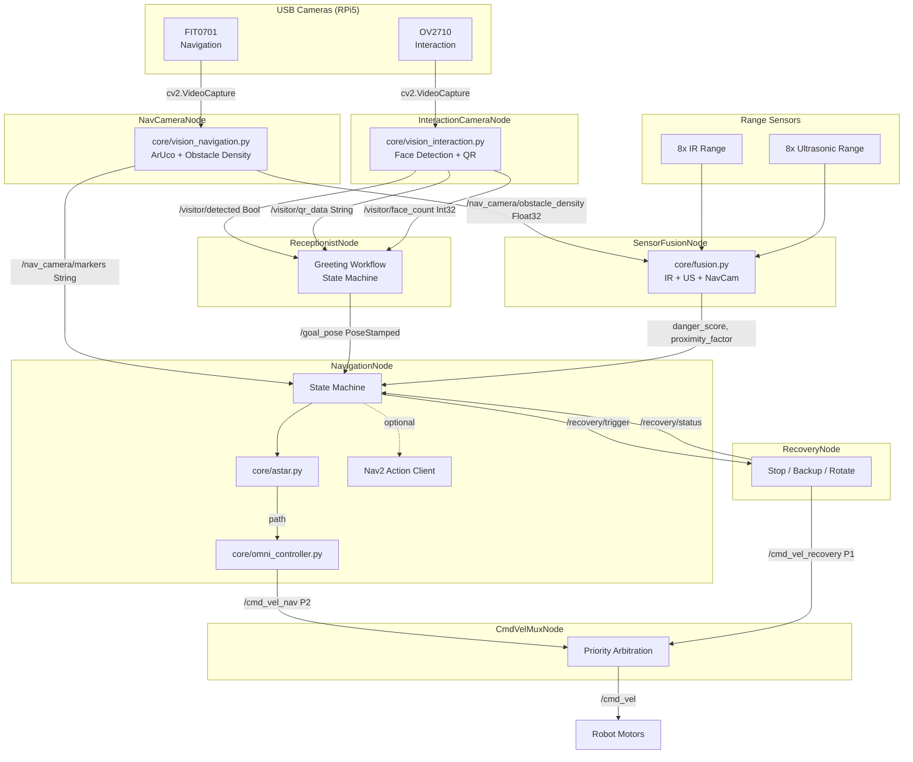

# Welcome Robot

## Project Status

This project is currently in the **development phase**.  
The focus is on building a modular and scalable autonomous receptionist robot system using ROS 2 and Python.

> Some components described below are planned and not fully implemented yet.

---

## Overview

This project develops an **indoor autonomous receptionist robot** capable of:

* Detecting approaching visitors using the OV2710 USB camera (face detection)
* Greeting visitors and scanning QR codes for destination routing
* Navigating autonomously to predefined office locations using ROS 2 and Nav2
* Detecting ArUco/AprilTag visual markers via the FIT0701 USB camera
* Performing obstacle avoidance with IR, ultrasonic, and camera-based sensor fusion
* Automatic recovery from navigation failures
* Integration with AWS cloud services for employee management and visitor logging (planned)

The system is designed with a **modular architecture** to allow easy integration of hardware and future expansion.

---

## Hardware

| Component | Purpose |
|---|---|
| Raspberry Pi 5 | Main compute |
| OV2710 2MP USB Camera | Face detection, QR scanning, visitor presence |
| FIT0701 USB Camera | Navigation assist, ArUco/AprilTag detection |
| 8x IR Range Sensors | Close-range obstacle detection |
| 8x Ultrasonic Sensors | Medium-range obstacle detection |
| NanoClaw Motor Controller | Omnidirectional drive |
| TCS3200 Color Sensors | Boundary detection (planned) |

---

## System Architecture



---

## Receptionist Workflow

The robot follows a five-state greeting workflow:

```
IDLE -> GREETING -> WAITING_QR -> NAVIGATING -> ARRIVED -> IDLE
```

1. **IDLE** -- Waits for a visitor (face detection via OV2710)
2. **GREETING** -- Publishes greeting message for TTS
3. **WAITING_QR** -- Scans QR code for destination name (30s timeout)
4. **NAVIGATING** -- Sends goal to Nav2 and follows path
5. **ARRIVED** -- Announces arrival and returns to idle

### Named Destinations

| Name | Description |
|---|---|
| `reception` | Main reception area |
| `conference_room` | Conference room |
| `hr_room` | HR department |
| `manager_cabin` | Manager's office |

---

## Velocity Priority (cmd_vel Mux)

| Priority | Topic | Source | When Active |
|---|---|---|---|
| **P0** (highest) | `/cmd_vel_emergency` | Any node | Imminent collision |
| **P1** | `/cmd_vel_recovery` | RecoveryNode | Recovery maneuvers |
| **P2** (lowest) | `/cmd_vel_nav` | NavigationNode | Normal path following |

---

## Technology Stack

| Layer | Technology |
|---|---|
| Middleware | ROS 2 (Humble/Jazzy) |
| Language | Python |
| Vision | OpenCV (Haar cascade, ArUco, QR) |
| Navigation | Nav2 + custom A* planner |
| SLAM | slam_toolbox |
| Motor Controller | NanoClaw |
| Compute | Raspberry Pi 5 |

---

## Project Structure

```
Welcoming-Robot/
├── config.py                              # All tuneable parameters
├── config/
│   └── slam_toolbox_params.yaml           # SLAM configuration
├── core/
│   ├── __init__.py
│   ├── astar.py                           # A* global planner
│   ├── fusion.py                          # Sensor fusion (IR + US + nav cam)
│   ├── omni_controller.py                 # Holonomic pure pursuit
│   ├── vision_interaction.py              # Face detection + QR scanning
│   └── vision_navigation.py              # ArUco detection + obstacle density
├── launch/
│   └── navigation_launch.py               # ROS 2 launch file (8 nodes)
├── nodes/
│   ├── __init__.py
│   ├── cmd_vel_mux_node.py                # Velocity priority mux
│   ├── interaction_camera_node.py         # OV2710 driver node
│   ├── nav_camera_node.py                 # FIT0701 driver node
│   ├── navigation_node.py                 # Main brain (state machine)
│   ├── receptionist_node.py               # Greeting workflow orchestrator
│   ├── recovery_node.py                   # Stuck handling
│   └── sensor_fusion_node.py              # Raw sensor -> fused output
└── utils/
    ├── __init__.py
    ├── geometry.py                         # Math helpers
    ├── grid.py                             # OccupancyGrid utilities
    └── path.py                             # Path pruning / smoothing
```

---

## ROS Topics

### Camera Topics (New)

| Topic | Type | Publisher | Subscriber |
|---|---|---|---|
| `/interaction_camera/image_raw` | Image | InteractionCameraNode | RViz |
| `/visitor/detected` | Bool | InteractionCameraNode | ReceptionistNode |
| `/visitor/face_count` | Int32 | InteractionCameraNode | ReceptionistNode |
| `/visitor/qr_data` | String | InteractionCameraNode | ReceptionistNode |
| `/nav_camera/image_raw` | Image | NavCameraNode | RViz |
| `/nav_camera/obstacle_density` | Float32 | NavCameraNode | SensorFusionNode |
| `/nav_camera/markers` | String | NavCameraNode | NavigationNode |

### Navigation Topics

| Topic | Type | Publisher | Subscriber |
|---|---|---|---|
| `/cmd_vel_nav` | Twist | NavigationNode | CmdVelMuxNode |
| `/cmd_vel_recovery` | Twist | RecoveryNode | CmdVelMuxNode |
| `/cmd_vel_emergency` | Twist | Any | CmdVelMuxNode |
| `/cmd_vel` | Twist | CmdVelMuxNode | Robot HW |
| `/goal_pose` | PoseStamped | ReceptionistNode / RViz | NavigationNode |
| `/planned_path` | Path | NavigationNode | RViz |
| `/obstacle/danger_score` | Float32 | SensorFusionNode | NavigationNode |
| `/obstacle/min_range` | Float32 | SensorFusionNode | NavigationNode |
| `/obstacle/proximity_factor` | Float32 | SensorFusionNode | NavigationNode |

### Receptionist Topics

| Topic | Type | Publisher | Subscriber |
|---|---|---|---|
| `/receptionist/status` | String | ReceptionistNode | UI / Logger |
| `/receptionist/greeting` | String | ReceptionistNode | TTS (future) |

---

## How to Launch

```bash
# Full stack (all 8 nodes + SLAM):
ros2 launch launch/navigation_launch.py

# Individual nodes:
python3 nodes/interaction_camera_node.py
python3 nodes/nav_camera_node.py
python3 nodes/receptionist_node.py
python3 nodes/sensor_fusion_node.py
python3 nodes/navigation_node.py
python3 nodes/recovery_node.py
python3 nodes/cmd_vel_mux_node.py
```

## Send a Goal Manually

```bash
ros2 topic pub --once /goal_pose geometry_msgs/PoseStamped \
  "{header: {frame_id: 'map'}, pose: {position: {x: 2.0, y: 1.5, z: 0.0}}}"
```

---

## Current Progress

| Component | Status |
|---|---|
| Architecture Design | Completed |
| ROS 2 Setup | Completed |
| Core Modules | Completed |
| Dual Camera Integration | Completed |
| Receptionist Workflow | Completed |
| Path Planning (A*) | Completed |
| Controller (Pure Pursuit) | Completed |
| Sensor Fusion | Completed |
| cmd_vel Mux | Completed |
| SLAM Integration | Pending |
| Hardware Integration | Pending |
| Simulation (Gazebo) | Pending |
| Real-world Testing | Pending |

---

## Design Principles

- Modular and scalable architecture
- Hardware-independent logic (core/ has zero ROS imports)
- Clear separation of concerns (utils -> core -> nodes)
- One camera per node, one responsibility per module
- Graceful degradation (camera failure does not crash navigation)
- Priority-based velocity arbitration (safety first)

---

## Note

This repository reflects an **ongoing development process** focused on building a strong foundation before full deployment.
