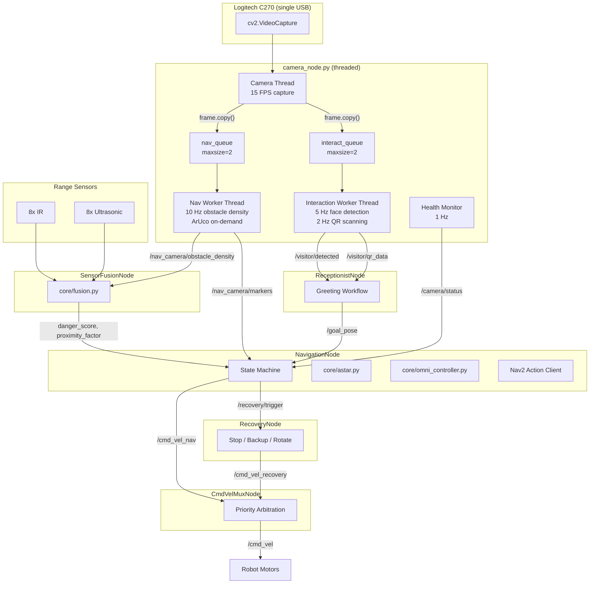

# Welcome Robot

## Project Status

This project is currently in the **development phase**.  
The focus is on building a modular and scalable autonomous receptionist robot system using ROS 2 and Python.

> Some components described below are planned and not fully implemented yet.

---

## Overview

This project develops an **indoor autonomous receptionist robot** capable of:

* Detecting approaching visitors using the Logitech C270 webcam (face detection)
* Greeting visitors and scanning QR codes for destination routing
* Navigating autonomously to predefined office locations using ROS 2 and Nav2
* Detecting ArUco/AprilTag visual markers for docking and landmark localization
* Performing obstacle avoidance with IR, ultrasonic, and camera-based sensor fusion
* Automatic recovery from navigation failures
* Integration with AWS cloud services for employee management and visitor logging (planned)

---

## Hardware

| Component | Purpose |
|---|---|
| Raspberry Pi 4 | Main compute |
| Logitech C270 USB Webcam | Face detection, QR scanning, obstacle density, ArUco (single camera) |
| 8x IR Range Sensors | Close-range obstacle detection |
| 8x Ultrasonic Sensors | Medium-range obstacle detection |
| NanoClaw Motor Controller | Omnidirectional drive |
| TCS3200 Color Sensors | Boundary detection (planned) |

---

## System Architecture



---

## Threading Model

The single `camera_node.py` uses a producer-consumer pattern with three daemon threads:

| Thread | Responsibility | Rate |
|---|---|---|
| Camera Thread | Owns `VideoCapture`, pushes `frame.copy()` to queues | 15 FPS |
| Nav Worker Thread | Canny obstacle density + ArUco (on-demand) | 10 Hz |
| Interaction Worker Thread | Haar face detection + QR scanning | 5 Hz / 2 Hz |

**Race condition prevention**: Workers never touch the camera. Each receives independent frame copies via `queue.Queue(maxsize=2)` with drop-oldest policy.

---

## Receptionist Workflow

```
IDLE -> GREETING -> WAITING_QR -> NAVIGATING -> ARRIVED -> IDLE
```

| State | Trigger | Action |
|---|---|---|
| IDLE | Face detected | Greet visitor |
| GREETING | Immediate | Publish greeting for TTS |
| WAITING_QR | QR scanned or 30s timeout | Look up destination |
| NAVIGATING | Goal reached | Send PoseStamped goal |
| ARRIVED | 2s elapsed | Announce arrival, return to idle |

### Named Destinations

| Name | Description |
|---|---|
| `reception` | Main reception area |
| `conference_room` | Conference room |
| `hr_room` | HR department |
| `manager_cabin` | Manager's office |

---

## Camera Health Monitoring

The camera node monitors the C270 connection and handles disconnections:

| State | Condition | Behavior |
|---|---|---|
| **ONLINE** | Frames arriving normally | Full vision processing |
| **OFFLINE** | No frames for 2 seconds | Camera released, nav uses range-only |
| **RECONNECTING** | Attempting reopen every 5s | Automatic recovery |

**Graceful degradation**: When camera is offline, navigation continues with IR + ultrasonic sensors only.

---

## Velocity Priority (cmd_vel Mux)

| Priority | Topic | Source | When Active |
|---|---|---|---|
| **P0** (highest) | `/cmd_vel_emergency` | Any node | Imminent collision |
| **P1** | `/cmd_vel_recovery` | RecoveryNode | Recovery maneuvers |
| **P2** (lowest) | `/cmd_vel_nav` | NavigationNode | Normal path following |

---

## Technology Stack

| Layer | Technology |
|---|---|
| Middleware | ROS 2 Humble |
| Language | Python |
| Vision | OpenCV (Haar cascade, ArUco, QR) |
| Navigation | Nav2 + custom A* planner |
| SLAM | slam_toolbox |
| Motor Controller | NanoClaw |
| Compute | Raspberry Pi 4 |

---

## Project Structure

```
Welcoming-Robot/
├── config.py                              # All tuneable parameters
├── config/
│   └── slam_toolbox_params.yaml           # SLAM configuration
├── core/
│   ├── __init__.py
│   ├── astar.py                           # A* global planner
│   ├── fusion.py                          # Sensor fusion (IR + US + nav cam)
│   ├── omni_controller.py                 # Holonomic pure pursuit
│   ├── vision_interaction.py              # Face detection + QR scanning
│   └── vision_navigation.py              # ArUco detection + obstacle density
├── launch/
│   └── navigation_launch.py               # ROS 2 launch file (7 nodes)
├── nodes/
│   ├── __init__.py
│   ├── camera_node.py                     # Unified threaded camera (C270)
│   ├── cmd_vel_mux_node.py                # Velocity priority mux
│   ├── navigation_node.py                 # Main brain (state machine)
│   ├── receptionist_node.py               # Greeting workflow orchestrator
│   ├── recovery_node.py                   # Stuck handling
│   └── sensor_fusion_node.py              # Raw sensor -> fused output
└── utils/
    ├── __init__.py
    ├── geometry.py                         # Math helpers
    ├── grid.py                             # OccupancyGrid utilities
    └── path.py                             # Path pruning / smoothing
```

---

## ROS Topics

### Camera Topics

| Topic | Type | Publisher | Subscriber |
|---|---|---|---|
| `/camera/image_raw` | Image | CameraNode | RViz (lazy) |
| `/camera/status` | String | CameraNode | NavigationNode |
| `/camera/enable_aruco` | Bool | Any | CameraNode |
| `/visitor/detected` | Bool | CameraNode | ReceptionistNode |
| `/visitor/face_count` | Int32 | CameraNode | ReceptionistNode |
| `/visitor/qr_data` | String | CameraNode | ReceptionistNode |
| `/nav_camera/obstacle_density` | Float32 | CameraNode | SensorFusionNode |
| `/nav_camera/markers` | String (JSON) | CameraNode | NavigationNode |

### Navigation Topics

| Topic | Type | Publisher | Subscriber |
|---|---|---|---|
| `/cmd_vel_nav` | Twist | NavigationNode | CmdVelMuxNode |
| `/cmd_vel_recovery` | Twist | RecoveryNode | CmdVelMuxNode |
| `/cmd_vel_emergency` | Twist | Any | CmdVelMuxNode |
| `/cmd_vel` | Twist | CmdVelMuxNode | Robot HW |
| `/goal_pose` | PoseStamped | ReceptionistNode / RViz | NavigationNode |
| `/planned_path` | Path | NavigationNode | RViz |
| `/obstacle/danger_score` | Float32 | SensorFusionNode | NavigationNode |
| `/obstacle/min_range` | Float32 | SensorFusionNode | NavigationNode |
| `/obstacle/proximity_factor` | Float32 | SensorFusionNode | NavigationNode |

### Receptionist Topics

| Topic | Type | Publisher | Subscriber |
|---|---|---|---|
| `/receptionist/status` | String | ReceptionistNode | UI / Logger |
| `/receptionist/greeting` | String | ReceptionistNode | TTS (future) |

---

## CPU Budget (Raspberry Pi 4)

| Process | Est. CPU % |
|---|---|
| ROS 2 + DDS | ~8% |
| slam_toolbox | ~12% |
| Camera capture (15 FPS) | ~3% |
| Nav worker (Canny, 10 Hz) | ~5% |
| Face detection (Haar, 5 Hz) | ~6% |
| QR decoding (2 Hz) | ~3% |
| Sensor fusion + controller | ~8% |
| Recovery + mux + receptionist | ~2% |
| **Total** | **~47%** |

ArUco (when enabled): adds ~4%. Total with ArUco: ~51%.

---

## How to Launch

```bash
# Full stack (all 7 nodes + SLAM):
ros2 launch launch/navigation_launch.py

# Individual nodes:
python3 nodes/camera_node.py
python3 nodes/sensor_fusion_node.py
python3 nodes/navigation_node.py
python3 nodes/recovery_node.py
python3 nodes/cmd_vel_mux_node.py
python3 nodes/receptionist_node.py

# Enable ArUco detection at runtime:
ros2 topic pub --once /camera/enable_aruco std_msgs/Bool "data: true"
```

## Send a Goal Manually

```bash
ros2 topic pub --once /goal_pose geometry_msgs/PoseStamped \
  "{header: {frame_id: 'map'}, pose: {position: {x: 2.0, y: 1.5, z: 0.0}}}"
```

---

## Current Progress

| Component | Status |
|---|---|
| Architecture Design | Completed |
| ROS 2 Setup | Completed |
| Core Modules | Completed |
| Single Camera Integration | Completed |
| Threaded Vision Pipeline | Completed |
| Receptionist Workflow | Completed |
| Path Planning (A*) | Completed |
| Controller (Pure Pursuit) | Completed |
| Sensor Fusion | Completed |
| cmd_vel Mux | Completed |
| Camera Health Monitoring | Completed |
| SLAM Integration | Pending |
| Hardware Integration | Pending |
| Simulation (Gazebo) | Pending |
| Real-world Testing | Pending |

---

## Design Principles

- Single camera owner (no device conflicts)
- Thread-safe frame distribution (queue.Queue, frame.copy())
- CPU-aware staggered processing rates
- Graceful degradation (camera failure ≠ robot crash)
- Hardware-independent vision logic (core/ has zero ROS imports)
- Priority-based velocity arbitration (safety first)
- On-demand ArUco (disabled by default to save CPU)

---

## Note

This repository reflects an **ongoing development process** focused on building a strong foundation before full deployment.
